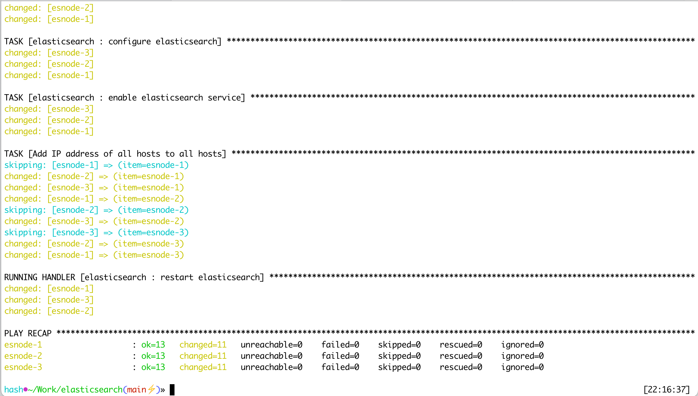

# Launch elasticsearch cluster on [hetzner.cloud](https://www.hetzner.com/cloud)

Project consists of two main stages:
1. Infrastructure provisioning - create VM's for the cluster
2. Cluster configuration - configure VM's for the cluster

## Requirements
1. To run the project you need active account in hetzner cloud.
2. Once you create new project, navigate to the security settings and add you SSH public key.
The key will be used to access all VM's we'll create

3. To be able programmatically manage HCloud infrastructure we also need to generate new API token with read/write permissions


## Infrastructure provisioning
To create VM's first of all you need to add API TOKEN to the **infra/example.auto.tfvars** file. 
There you can also set
- VM location
- VM type (size)
- VM operating system

```terraform
hcloud_token    = "XXXXXXXXXXXXXXXXXXXXXXXXXXXXXXXXXXXXXXXXXXXXXXXXXXXXXXXXXXXXXXXX"
nodes_count     = 3
hcloud_location = "nbg1"
base_image      = "ubuntu-22.04"
server_type     = "cpx11"
```
To create infrastructure, navigate to **infra** folder and run following commands
```shell
terraform init
terraform plan
terraform apply --auto-approve
```


once it's done, you'll get new virtual machines and new ansible inventory file **inventory/infra.ini** which will look like
```ini
[elasticsearch]

esnode-1 ansible_host=78.46.181.118
esnode-2 ansible_host=128.140.81.106
esnode-3 ansible_host=142.132.176.65

[elasticsearch:vars]
ansible_python_interpreter=/usr/bin/python3
timezone=Europe/Amsterdam

[all:vars]
env=infra
ansible_ssh_user=root
```

## Cluster configuration
Once you have all VM and ansible inventory file, navigate to the root of the project and run
```shell
./elasticsearch-configure.yml
```

You should see output similar to


## Test connection

Copy output of **elasticsearch_ip** from terraform and open url http://**elasticsearch_ip**:9200


## Cleanup infrastructure

To delete all created resources run following from the **infra** dir
```shell
terraform destroy --auto-approve
```


